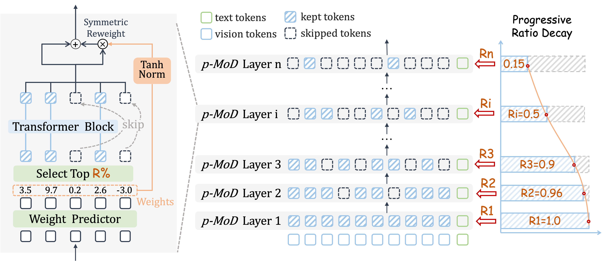
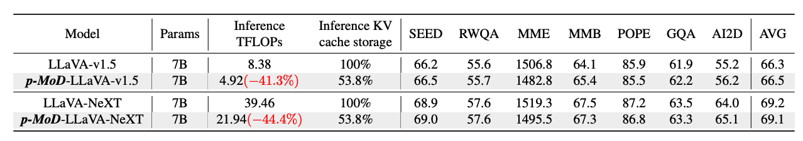
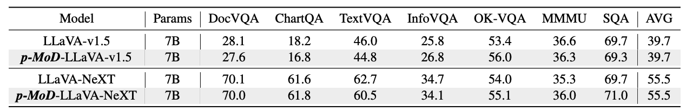

# p-MoD: Building Mixture-of-Depths MLLMs via Progressive Ratio Decay

[Jun Zhang](https://home.j-zh.top/), [Desen Meng](https://github.com/Kerin637), Ji Qi, Zhenpeng Huang, Tao Wu, and [Limin Wang](https://scholar.google.com/citations?user=HEuN8PcAAAAJ).

[](https://arxiv.org/abs/2412.04449)
[](https://huggingface.co/collections/JungleGym/p-mod-67506ac52553d194c55782df)



We present **p-MoD**, a series of efficient MLLMs which features:
- :scissors: **Mixture-of-Depths** mechanism, upgraded with tanh-gated weight normalization (TanhNorm) and symmetric token reweighting (STRing).
- :roller_coaster: **Progressive ratio decay (PRD)** strategy, which gradually reduces the token retention ratio layer by layer.

## :closed_book: Performance and Efficiency
**p-MoD** matches or even surpasses the performance of the baseline models, with only 55.6% TFLOPs and 53.8% KV cache storage during inference, and 77.7% GPU hours during training.





## :hammer_and_wrench: Requirements and Installation

1. Clone this repository and navigate to the folder
```bash
git clone https://github.com/MCG-NJU/p-MoD.git
cd p-MoD
```

2. Install packages
```Shell
conda create -n p-mod python=3.10 -y
conda activate p-mod
pip install --upgrade pip  # enable PEP 660 support
pip install -e .
pip install -e lmms-eval
```

3. Install additional packages for training cases
```Shell
pip install -e ".[train]"
pip install flash-attn --no-build-isolation --no-cache-dir
```

4. Login to huggingface and wandb
```Shell
huggingface-cli login
wandb login
```

## :tiger: Model Zoo
| Model                                                                       | LLM       | Epoch | Pretrain Data | SFT Data |
| --------------------------------------------------------------------------- | --------- | ----- | ------------- | -------- |
| [p-MoD-LLaVA-NeXT-7B](https://huggingface.co/MCG-NJU/p-MoD-LLaVA-NeXT-7B) | Vicuna-7B | 1     | 558K          | 779K     |
| [p-MoD-LLaVA-v1.5-7B](https://huggingface.co/MCG-NJU/p-MoD-LLaVA-v1.5-7B) | Vicuna-7B | 1     | 558K          | 665K     |


## :bar_chart: Evaluation
We evaluate our model using lmms-eval. You can use our script `./scripts/lmms-eval/eval.sh`, for example:
```Shell
bash ./scripts/lmms-eval/eval.sh \
  --ckpt MCG-NJU/p-MoD-LLaVA-NeXT-7B \
  --eval_tasks ai2d,chartqa \
  --project_name pmod \
  --run_name pmod-llava-next-7b-ft
```

## :rocket: Train
### Pretraining
We use the pretrained MLP projector provided by [LLaVA](https://github.com/haotian-liu/LLaVA/blob/main/docs/MODEL_ZOO.md), which can be downloaded [here](https://huggingface.co/liuhaotian/llava-v1.5-mlp2x-336px-pretrain-vicuna-7b-v1.5). Then put the downloaded model weights under `./checkpoints/llava-v1.5-7b-pretrain/llava-official-checkpoint`.

### p-MoD-LLaVA-NeXT
First, we provide our script `./util_scripts/download_llava-next_data.py` for data preparation. This script downloads the [779K LLaVA-NeXT data](https://huggingface.co/datasets/lmms-lab/LLaVA-NeXT-Data), saves the images under `./playground/data/llava_next_images/` and data json to the path `./playground/data/llava_next_data.json`.

Then you can start training using `./scripts/train/finetune_eval_7b_pmod_llava_next.sh`.

### p-MoD-LLaVA-1.5
First, prepare instruction tuning data following [LLaVA-1.5](https://github.com/haotian-liu/LLaVA#visual-instruction-tuning). Download the images from constituting datasets, and the dataset annotation json [llava_v1_5_mix_665k.json](https://huggingface.co/datasets/liuhaotian/LLaVA-Instruct-150K/blob/main/llava_v1_5_mix665k.json). Save the images and the json under `./playground/data`.

Then, we fix some broken examples in the data json by running the script
```Shell
python util_scripts/clean_data_json.py \
--original_json_path ./playground/data/llava_v1_5_mix665k.json \
--cleaned_json_path ././playground/data/llava_v1_5_mix665k_cleaned.json
```

Start training with `./scripts/train/finetune_eval_7b_pmod_llava_1_5.sh`.

## :page_facing_up: Citation
If you find our work helpful for your research and applications, please cite our paper:
```
@article{zhang2024p,
  title={p-MoD: Building Mixture-of-Depths MLLMs via Progressive Ratio Decay},
  author={Zhang, Jun and Meng, Desen and Qi, Ji and Huang, Zhenpeng and Wu, Tao and Wang, Limin},
  journal={arXiv preprint arXiv:2412.04449},
  year={2024}
}
```

## :dizzy: Acknowledgement
- [LLaVA](https://github.com/haotian-liu/LLaVA) and [LLaVA-NeXT](https://github.com/LLaVA-VL/LLaVA-NeXT): The codebases we built upon.
- [lmms-eval](https://github.com/EvolvingLMMs-Lab/lmms-eval): We use this amazing framework for evaluation.
